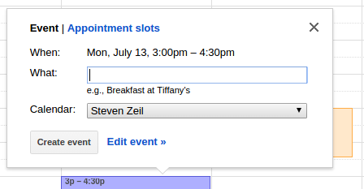
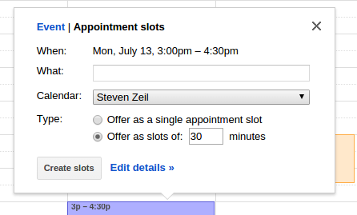
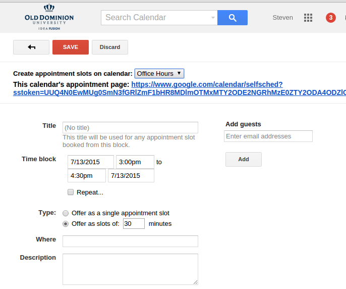

Title: Using Google Calendar for Appointment Setups
Author: Steven Zeil
Date: @docModDate@

I have a real love-hate relationship with office hours. I _want_ to
be accessible to students at a wide variety of times, but I _don't_
want to be tied to sitting in my office on those days when nobody is
going to show.

Distance course offerings make this worse. Many can't come to campus
and need to attend "office hours" by network conferencing (trying to
work out problems with mathematical or computer programming
assignments over the telephone is just too painful for everyone
involved). But I don't want to set up conferences for hours at a time
if no one is going to actually connect in.

So what I really want is the ability to schedule blocks of -available_
time, from which students can select if they want to meet with me. I
want them to be able to tell me if they intend to meet with me
face-to-face, by network conferencing, or by phone. And I want to be
notified when a students makes one of these appointments.

# Here's my Solution

\picOnLeft{appointmentButtons,60}

Take a look at
[this calendar](https://www.google.com/calendar/selfsched?sstoken=UUQ4N0EwMUg0SmN3fGRlZmF1bHR8MDlmOTMxMTY2ODE2NGRhMzE0ZTY2ODA4ODZlOTg5YTg). If
you are viewing this between semesters, you may need to move forward
or backward a few weeks, but you should see a typical Google calnedar,
but with "Office Hours" buttons in the place of the usual event listings.

\picOnRight{appointmentDialog,60}

Click on one of these buttons and you will see a "Book an Appointment"
dialog. (Feel free to try it -- just don't save the appointment unless
you _really do_ want to meet with me.)

If you were to actually save that appointment, you and I would each
receive an email notice that an appointment had been booked, and the
appointment would be added to each of our respective Google calendars.

# How Did I Do That?

I'm making use here of a feature, "appointment slots", of Google
Calendar that is only provided to Goggle's industrial and educational
customers. ODU is one such educational customer.

This means that all faculty and students can log into a variety of
Google services using their `@odu.edu` email address. One of those
services is the Google calendar service.

## Setting up Appointment Signups

To make this work, you need _two_ Google calendars.

* The first, which I will refer to as your "signup calendar", is where
  these buttons will appear.  This should be a new calendar that you
  are going to create specifically for this purpose.
* The second, which I will refer to as your "event" calendar, is the
  one where appointments that students have made will appear. This can
  be an existing calendar if you have one that you are already using.

> Optional but recommended: If you have a personal GMail account,
  use that to create your event calendar.
>
> The reason is that email will be sent to the event calendar's account
  whenever someone makes an appointment. Because ODU faculty don't use
  GMail for their `@odu.edu`, you won't receive these notices if your
  event calendar is an ODU one. But if your event calendar is actually
  associated with a personal `@gmail.com` address, you _will_ receive
  email notices when someone makes an appointment.

1. Go to [Google Calendar](https://google.com/calendar), signing in
with your `@odu.edu` email and _no password_. You will then be
diverted the usual ODU Midas login page where you can enter your ODU
password.

2. Click the triangle alongside "My calendars" to drop down a menu,
   and select "Create new calendar".

    Name this calendar "Appointments".

    Check the time zone and correct if necessary.

	Select "Make this calendar public".

3. If you are going to use a personal calendar as your
	  event calendar, then enter your personal Gmail address
	  under "Share with specific people", select "Make changes and
	  manage sharing" for the Permissions Settings, and click "Add Person".

4.	Click the "Create Calendar" button at the bottom of the page.

5. If you are going to use a personal calendar for your event calendar,
   sign out of Google now. Then sign in again, this time with your
   personal `@gmail.com` address. Go to your personal calendar page.

    You should see your new appointment calendar listed under "My
    calendars". If the box to the left of it is clear, click to select
    it, making the calendar visible. (You won't see much, because we
    don't have anything in there yet).
    
    Click the triangle next to your new appointment calendar to get
    the drop-down menu and select "Calendar Settings".

    * Click the "Edit notifications" link near the top.

        Under "Choose how you want to be kept up-to-date", add checks
        to the boxes for "New events", "Changed events", "Canceled
        events", and "Event responses".

        (If you had tried to do this when logged in under your
        `@odu.edu` address, it would not have worked because ODU
        faculty don't use GMail and therefore can't receive notices
		by email. Sharing the ODU appointment calendar with your
        personal account is a loophole that let's us
		work around this limitation.)

    Save.
	

# Making a Block of Time Available

1. If you are already logged in to Google services under a personal
   account, sign out.
   
2. Go to [Google Calendar](https://google.com/calendar), signing in
with your `@odu.edu` email and _no password_. You will then be
diverted the usual ODU Midas login page where you can enter your ODU
password.

3. Click and drag your mouse across a block of time that you want to
   make available for appointments.

    
	You'll see what may be a familiar Google "create an event" dialog,
	but with a new option: "Appointment slots".

    Click on "Appointment slots".

    
 

    

4. 
   Now you have some new options allowing you to treat the entire time
   period as a single slot or to subdivide it into multiple slots I
   typically divide it up into 15 minute slots.

5. Under "What", put an appropriate description such as "Office
   Hours".

6. **Important**: Under "Calendar", select your appointment calendar.

7. Click "Edit details >>".

    
 

8. 
   You will see something like this.

    You can use the "Repeat..." box, if you wish, to set this
	up as a repeating time slot occurring every week.

	More importantly, look at the long ugly web URL alongside "This
    calendar's appointment page". That is the address you publish to
    your students to give them access, not just to this time slot,
    but to your entire appointment calendar.  Copy and paste this into
	some convenient location. Then add it to your course website or
    your ODU home page.
	

9. Save.

    If you now go to the URL that you copied-and-pasted in the last
    step, you should see a set of appointment buttons waiting
	for your students.

A final note: Unlike normal Google calendar events, appoint slots
cannot be edited. So if, for example, you decide that you want to change an
appointment block from 1:00PM to 1:30PM, you can't alter the existing
block. You have to delete the existing 1:00 block and create a new one at 1:30.
