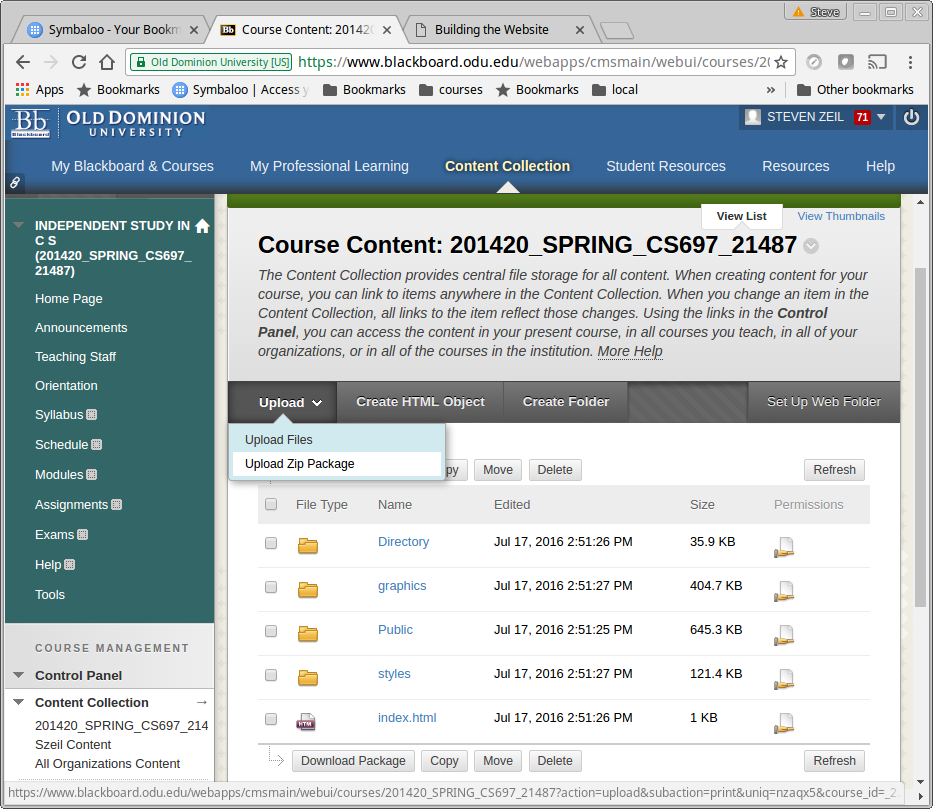

Title: Building the Website
Author: Steven Zeil
Date: @docModDate@
TOC: yes

CoWeM uses [Gradle](https://gradle.org) to automate the process of building the website.

Gradle is a build manager for software projects. Although a website may not involve programming
in the usual sense, it can certainly be regarded as a software system. If your only experience with
with build managers has been the ones built in to a programming IDE or the venerable Unix `make` utility,
you may be surprised at the range of features provided by Gradle.  Of particular relevance to CoWeM:

* Gradle allows the steps involved in a build, such as copying and and manipulation of files, to be described and performed in in a portable (not dependent on a specific operating system) manner.

* Gradle can fetch and incorporate software packages needed for the build from over the internet,
  and can check periodically for updates to those packages.
  
* The ability to fetch needed software packages extends to Gradle itself, so by including a few small
  files in each copy of a CoWeM course, the Gradle build system can be bootstrapped on to any Linux,
  Windows, or OS/X machine with a reasonably up-to-date Java environment (JRE).
  
* Gradle can be extended, teaching it new processes for different kinds of projects, via a _plugin_ system.
    * CoWeM is, in fact, implemented as a package of related Gradle plugins.

# Running Gradle

\bSidebar

    course root/
    |- settings.gradle
    |- build.gradle
    |- gradlew
    |- gradlew.bat
    |- gradlew-gui.bat
    |- gradle/
    |- /*...*/

\eSidebar

The files `gradlew` , `gradlew.bat`, and `gradlew-gui.bat` are scripts
that are used to launch the gradle build manager to request building the
website.  The `.bat` files are for Windows. The simple `gradlew` file is used
for both Linux and OS/X. 

The first time that you run one of these on a given machine, it will
download the actual Gradle build manager and install it in your personal
account area (Look for a `.gradle` directory in your user home directory.)
It will then proceed to download the latest version of CoWeM and of the
various software libraries used by CoWeM. This software is stored in a cache
(within the afore-mentioned `.gradle`directory). Items in the cache expire
periodically (typically after 24 hours), so that Gradle will check at intervals
to see if any of that software has been updated.

Gradle can be run in a command-line mode or a GUI mode.  

## Windows

To run in command-line mode, open a `cmd` window, `cd` to your course root
directory, and run

`gradlew` _target_

The possible _targets_ are discussed in the next section.

To run in GUI mode, do the same and run

`gradlew-gui`

or simply view the course root root directory in the Windows File Explorer and
double-click the `gradle-gui.bat` file.

## Linux  

To run in command-line mode, open a terminal window, `cd` to your course root
directory, and run

`./gradlew` _target_

The possible _targets_ are discussed in the next section.

To run in GUI mode, do the same and run

`./gradlew --gui &`
 

## The GUI Mode

\picOnRight{gradle-gui, 66}

In GUI mode, Gradle displays a list of possible build targets
(in the top panel), which
will include those discussed in the next section plus a variety of "generic"
Gradle targets.

You can click on any of them to select it, then click the small green "run"
button at the top of the upper panel to execute that target.    

# The Gradle Build Targets

The following are the targets that can be supplied to Gradle at the command
line or selected from the GUI. 

## Building the Website

build
: Build the website by processing the document sets. The resulting website
  can be found in the directory `build/website` (under the course root
  directory).   You can use your favorite web browser "Open File" command to
  view any of the HTML files that have been generated. 

The `build` target is the default. If you don't specify a target at the
command line, `build` is run.

clean
: Delete all files that can be reconstructed via the `build` target. This is
  done by deleting the entire `build` directory. 

    As noted earlier, you can "clean" a project by simply deleting the
    `build` directory via normal operating system commands.

## Deploying the Website

"Deploying" a website means to copy it onto the server where it will be hosted.
Three options are supported for this. The relevant targets are:

\bSidebar{66}

**course root build.gradle:**

    course {
        courseName        = 'CS 350'
        courseTitle       = 'Introduction to Software Engineering'
        semester          = 'Fall 2016'
        sem               = 'f16'
        instructor        = 'Steven J Zeil'
        email             = 'zeil@cs.odu.edu'  
        copyright         = '2016, Old Dominion Univ.'
        homeURL           = '../../Directory/outline/index.html'
        /*+*/deployDestination = '/home/zeil/secure_html/cs350/f16/'/*-*/
    }
    
\eSidebar

deploy
: Synchronize the `build/website` with a directory specified in the course
  configuration (`build.gradle`) as  `deployDestination`.
  
    This works only if the destination directory is on the same
    local file system as the machine on which you are working.

\bSidebar{66}

**course root build.gradle:**

    course {
        courseName        = 'CS 350'
        courseTitle       = 'Introduction to Software Engineering'
        semester          = 'Fall 2016'
        sem               = 'f16'
        instructor        = 'Steven J Zeil'
        email             = 'zeil@cs.odu.edu'  
        copyright         = '2016, Old Dominion Univ.'
        homeURL           = '../../Directory/outline/index.html'
        /*+*/sshDeployURL      = 'zeil@atria.cs.odu.edu:/home/zeil/secure_html/cs350/f16/'
        sshDeployKey      = 'courseKey.rsa'/*-*/
    }
    
\eSidebar

deployBySsh
: Deploy the `build/website` to a directory on a remote machine 
  configuration (`build.gradle`) as  `sshDeployURL`.

    * You may optionally also specify an SSH key for access to that
      remote machine as `sshDeployKey`.
    * If no such key is used, this use any
      ssh key agent you might have running to authenticate
      on the remote machine.
        * There is currently no option for supplying a simple password.
          (Coming?)
    * Currently this deployment is done by packing the entire website
      into a Zip file archive, sending that file to the remote
      directory, and remotely issuing an `unzip` command there. 
      
        If the website is large and only a few files have been changed,
        this can be quite slow.  

\bSidebar{66}

**course root build.gradle:**

    course {
        courseName        = 'CS 350'
        courseTitle       = 'Introduction to Software Engineering'
        semester          = 'Fall 2016'
        sem               = 'f16'
        instructor        = 'Steven J Zeil'
        email             = 'zeil@cs.odu.edu'  
        copyright         = '2016, Old Dominion Univ.'
        homeURL           = '../../Directory/outline/index.html'
        /*+*/rsyncDeployURL      = 'zeil@atria.cs.odu.edu:/home/zeil/secure_html/cs350/f16/'
        rsyncDeployKey      = 'courseKey.rsa'/*-*/
    }
    
\eSidebar

deployByRsync
: Synchronize the `build/website` with a directory on a remote machine 
  configuration (`build.gradle`) as  `rsyncDeployURL` using the
  `rsync` protocol.
   
    * This can only be done if the machine on which you are running
      has the `rsync` command installed. 
    * You may optionally also specify an SSH key for access to that
      remote machine as `rsyncDeployKey`.
    * If no such key is used, this will still take advantage of any
      ssh key agent you might have running.
    * The `rsync` protocol will only transfer files that have been
      changed since the last deployment. For large files in which
      only small portions have changed, `rsync` will try to transfer
      only the changed portions.  This makes `rsync` ideal for
      updating websites after only a few things have been changed.  
      
All deployment commands will do a `build` first, if necessary.

## Packaging the Website

_Packaging_ refers to packing up the entire website into a single file that
can later be uploaded to a particular server.  All packages are deposited in
the `build/packages` directory.

CoWeM cab build both "fat" and "thin" packages.  A _fat_ package contains
the entire website. A _thin_ package contains navigation items that link
back to a deployed version of the full website elsewhere.   

Build options are:

zip
:  Package the website as a Zip archive.

    This can be unpacked in any directory managed by a web server
    to make the course content available. This includes a
    [Blackboard content collection](#importing-a-zip-package). 

bb
: _Deprecated in favor of_ `scorm` _(see below)_.

    Package the website as a fat Blackboard module that can
    be imported into a Blackboard course.  Content included is
  
    * The entire website is exported to the Blackboard course 
      Content Area.
    * All links from the `Directory/navigation` document set are added
      to the navigation panel of the Blackboard course.
    * All dates found in items in the course outline 
      (`Directory/outline`) are added to the Blackboard calendar. 

    Brief instructions on importing Blackboard packages is given
    [below](#importing-a-bb-or-bbthin-package).

\bSidebar{66}

**course root build.gradle:**

    course {
        courseName        = 'CS 350'
        courseTitle       = 'Introduction to Software Engineering'
        semester          = 'Fall 2016'
        sem               = 'f16'
        instructor        = 'Steven J Zeil'
        email             = 'zeil@cs.odu.edu'  
        copyright         = '2016, Old Dominion Univ.'
        homeURL           = '../../Directory/outline/index.html'
        /*+*/baseURL      = 'https://www.cs.odu.edu:/~zeil/cs350/f16/'/*-*/
    }
    
\eSidebar

bbthin
: Package the website as a Blackboard module that can be imported into
  a Blackboard course.  Content included is
  
    * All links from the `Directory/navigation` document set are added
      to the navigation panel of the Blackboard course. These are
      resolved to absolute URLs to a deployed version of the course
      website whose root directory is located at the `baseURL`.
    * All dates found in items in the course outline 
      (`Directory/outline`) are added to the Blackboard calendar. 

    Brief instructions on importing Blackboard packages is given
    [below](#importing-a-bb-or-bbthin-package).
    
scorm
: Package the website as a SCORM 1.2 package that can be imported into
  Blackboard or most other Learning Management Systems.

    Brief instructions on importing a SCORM package into
    Blackboard is given [below](#importing-a-scorm-package).
    
    The SCORM format does not include calendar updates
    in Blackboard, but calendar entries can be generated
    and imported as a `bbthin` target.

## Building a Specific Document Set Directory

If you are working intensively on a single document or document set, you can
instruct CoWeM to build or deploy only that one document set, saving some
time.

There are several ways to do this:

* If working in the Gradle GUI, you will see your CoWem groups as expandable
  items in the list of targets. Expanding one of those groups will give you a
   list of the document sets in that group. Expand one of those document sets
   and you can select a target to be applied to that document set. 

* Working at the command line, if you `cd` into the document set directory,
  you can specify the build targets just as you would at the top. The one
  caution is that you must invoke `gradlew` via the path back to the
  document root. For example, to rebuild a course syllabus, you might do
  
        cd Public/syllabus
        ../../gradlew build 
  
  in Linux or OS/X. In Windows, you would do the same except using "\" instead
  of "/".

  
* Working at the command line, but `cd`'d into the course root directory, you
  can specify a target on a specific document set using the format 
  `:`_group_`:`_documentset_`:`_target_.  For example, to rebuild a course
  syllabus you could say
  
        ./gradlew :Public:syllabus:build
  
  
The targets that can be launched for a single document set are:

build
:  Same as the yop-level `build` target, but builds only the
   indicated document set.
  
deployDoc
: Like the top-level `deploy`, this builds the document set and copies it
  to the appropriate deployment directory on the same machine.
       
deployDocBySsh
: Like the top-level `deployBySsh`, this builds the document set and copies it
  to a remote machine via secure shell. 

deployDocByRsync
: Like the top-level `deployByRsync`, this builds the document set and copies it
  to a remote machine via an `rsync` command. 
  
#  Importing CoWeM Packages into Blackboard

## Importing a Zip Package

1. Create a _zip package_ using the _zip_ build target, as described above.
2. Go to your course on Blackboard, and enter a content collection area,
   either the course content area (visible only to students in that course)
   or your user content area (potentially visible to everyone on Blackboard).
3. Use the Blackboard controls to enter the folder where you want to put
   the course materials, or to create a new folder to hold them.
4.  In the `Upload` menu, 
   select "Upload Zip Package". 
5. Click the "Choose file" button, and select the Zip package you
   created in step 1.  You'll find it in your course's
   `build/packages/` directory.
6. Click "Submit".

    The Zip package will be uploaded, and after it has been uploaded,
    Blackboard will unpack it into the Content Collection folder you
    had selected.

Using the Blackboard controls, you can navigate to any items you like
(e.g., the course outline), then copy the URL from your web browser's address
bar and paste it into a document available to your students.

You can also add any item uploaded this way into your
Blackboard course's navigation bar by clicking the "+" at the upper left of
the navigation bar and selecting `Course Link`.  

## Importing a SCORM package

1. Use the _scorm_ build target, 
   as described above, to produce a package stored in
   `build/packages/scorm`...`.zip`
   
2. Enter your Blackboard course. Select (or create) a content area, such
   as the "Outline" area, and enter that area.
   
3. from the "`BuildContent`" menu, select "`Content package
   (SCORM)`" and follow the instructions to upload your newly generated
   `scorm`...`.zip` file.

4. There is no "grading" associated with these packages. So choose the following
   settings:
   
    * Make SCORM Available; yes
    * Number of Attempts: Allow unlimited attempts
    * Track Number of Views: whatever you like
    * Grade SCORM: No Grading
    * Grade SCOS: No 
    

## Importing a bb or bbthin Package

> **Important**:  When you use the Blackboard "import package" procedure,
> content is _added_ to your Blackboard course but never _replaces_ existing
> content.  You can not _update_ existing imported materials.  
> 
> It's important, therefore, that whenever you import material for the second
> (or third or ...) time, you delete the old versions first. Otherwise
> you are likely to wind up with really _ugly_ calendars and navigation bars
> and your content collection area will get increasingly large and confusing.  

1. Create a _bb_ or _bbthin_ package using the corresponding build target, 
   as described above.
2. \picOnRight{importPackage1,67} Go to your course on Blackboard, 
   select "`Import Package`" under `Packages 
   and Utilities`, then select "Import Package".
3. \picOnRight{importPackage2,67} Click the "Browse My Computer" button and 
   select the _bb_ or _bbthin_ package you
   created in step 1.  You'll find it in your course's
   `build/packages/` directory.
4. In the `Select Course Materials` area, choose the items you want to
   import:
    * Select `Calendar` if you want to add calendar entries from
      your course outline to the Blackboard calendar for your course.
      Leave this unselected if you have no dates in your outline, or
      if you have already imported calendar entries and have no need
      to change them, or if oyu have not yet finalized your dates and
      want to wait a little while.
      
        (Deleting calendar entries in Blackboard is particularly
         tedious, so I generally do this only when I am pretty sure I
         have nailed down all of my important dates.)
         
     * Select `Content Areas` and  `Navigation Settings` to update
       course content (`bb` packages) and the Blackboard navigation
       bar (both `bb` and `bbthin`).
       
         \picOnRight{importPackage3,67}
         Entries from your CoWeM navigation document will be added to
         the main Blackboard course navigation bar.  For a fat `bb`
         package, these entries will point to the copy of the website
         uploaded into the course Content Collection area. For the
         `bbthin` package, these entries will point to the "real"
         external website indicated by your course's `baseURL`
         parameter.  
      
      No other entries in this area will have any effect.
      
      
6. Click "Submit".  Blackboard will upload the package you specified and
   will queue up a background job to process it.
   
    Processing typically takes several minutes, but can take quite a
    long time if you have a very
    large website or if many other people have background jobs queued. 
    (For example, requests to copy materials from one Blackboard
    course to another are also handled as background jobs, and are
    quite common in the weeks
    leading up to a new semester.)
     
7. After the import has completed, you may want to rearrange the new navigation
   bar entries. (New entries are always added to the bottom of the bar.)